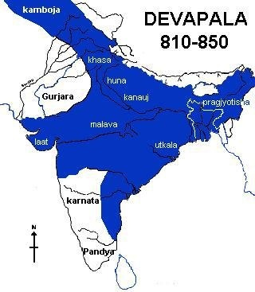

History for most of us, was always a major impediment, an obstacle, an immovable object opposing our unstoppable drive towards knowledge 
(Read Maths and Science). Useless questions like  ‘how does Babar’s fun and frolic in 1476 affect my future’ were raised, without an iota of 
hope for a definite answer. What we used to get was a growl or a scowl or perhaps both. What we could only do was utter the choicest expletives 
under our breath, memorize those never ending dates and practice our artistic talents on the unfortunate photographs of the great souls printed in our textbooks.

How will this dead dude help me get ahead in my life?

In our academic pecking order, Maths and Science always figured at the top,  subjects that we had to master. History mostly figured somewhere at 
the bottom of this list, lower than drawing, craft, value education and even Aayo Naga perhaps. Has our monumental indifference towards History 
enabled our educationists and academicians to disfigure, hell mutilate..our own history and actually get away with it?

Let me begin this by recalling a small conversation with a tenth grader relative of mine.
This is India’s history from that persons point of view:

1. Harappans were the first people in India, and they had a fetish for building abnormally large bath-tubs.
2. Their asses were then kicked by the some unknown invading Aryans.
3. Somewhere down the line, Alexander and his badass gang of Greeks came calling.
4. Chandragupta Maurya with his adviser Chanakya, did some awesome 420giri to take over from the Greeks.
5. They were then  succeeded by the Guptas who brought the ‘Golden Age’ with them.
6. Mahmud of Ghazni, however, looted all that gold. He needed a sum total of 17 visits to complete his gold quest.
7. Mohammad Ghauri followed him with similar intentions, but decided to avoid the trouble and simply stay back. And then he died.
8. He left his slave Qutub-ud-din Aibak to do all the ruling. His most significant achievement was to build one pointless tower.
9. Then came a Muslim queen, underlining our credentials in female liberation.
10. It was then the turn of Tughlaq and his gang of idiots. They moved national capitals around because they hated the weather.
11. From somewhere, Babar, a descendant of a lame, one eyed king from Central Asia landed in India.
12. He and his sons, calling themselves Mughals,  ruled India for the next 350 years.
13. Their party came to an end when Englishmen arrived, redcoats and all, and took a strong fancy to our country.

I am not making the above stuff up. Of course, I might have taken liberties with some of the descriptions, but then this was 
more-or-less what a tenth grader summarized about pre-British Indian history. I would have appreciated this individuals grasp of 
Indian history if not for the fact that this version is completely and utterly __bullshit__.

Yes IT IS

Peruse that list again, in case you did not read it carefully. Till the advent of the British, how many Indian emperors, 
kings have been mentioned in the above list? How many of them have been highlighted and glorified in our history despite some 
seriously awesome stuff they did? Has our History been modified to such an extent that our own ancestors have been left out of out of it?

The one word answer to the last question: __YES__

If you see, India is one of the very few countries to have a civilization which goes back to about 3000 BC. No other country has this big a history. 
To put it in perspective, India’s last golden age was in the 6th century BC. Wonder what were the others in the world doing at that time...

We are a civilization that was so advanced, that we were actually celebrating our golden age when Brits still hadn’t figured out 
what ”Being Clothed’ meant and the Americans could have been the name of an opium brand. So isn’t it kinda surprising that only two 
Indian emperors were considered to be worth remembering by a tenth grader in an eon or so? Would have been humorous, if it wasn’t our 
civilization. And because it is, it becomes deeply distressing and disturbing.

The Gupta dynasty as a dynasty, ended in about 6th century AD. However, the last meaningful king that our History textbooks bother 
to mention is Chandragupta II, whose reign ended in 4th Century AD. And then, the scene is fast forwarded to the point where Mohammad 
Ghauri invaded India in 1191, to start the Delhi Sultanate which would then metamorphose into the Islamic Empire. What does the above line tell you?
It tells you that an average tenth grader actually knows nothing about what happened in India in the intervening period between the Guptas and the 
Delhi Sultanate (A time period of about 800 years). At least they do not think it was worth remembering. To be fair they are not to blame, especially when 
you consider our academicians have dedicated ONE  single Chapter in the Seventh standard History textbook, to cover the period when it was Indians who ruled the land..
Yes.. ONE CHAPTER, COVERING A PERIOD OF A THOUSAND YEARS ENCOMPASSING THE WHOLE OF THE INDIAN CIVILAZTION. One Chapter from history lessons stretching 
across the fifth, sixth, seventh, eighth, ninth and the tenth grades of CBSE. One insignificant chapter in over five years of schooling dealing with a 
period of more than one thousand years.
Now why only one chapter, is known only to the enlightened souls who designed those textbooks. And as a result of either their deliberate oversight or 
perhaps pure ineptitude, most of the school children do not know have any idea about

### __The Harsha Empire__

This empire was founded by King Harshavardhana. This guy ascended the throne immediately after the Gupta dynasty, at an age when we aren’t 
allowed to have a driving license or have a drink. He became an emperor at the age of __sixteen__ in about 606 AD. He went on to capture what 
is today called North India (Including Kashmir) and Pakistan, His empire at its greatest extent looked something like this

He fought almost 300 battles in the 41 years he ruled with a win loss ratio that even Novak Djokovic would envy;  299-1. Uniting all these states, 
I guess was trouble even then.
Not only was he adept as a fighting machine, but actually authored three full length Sanskrit plays Ratnavali, 
Priyadarsika and Nagananda, while he was busy conquering. Nagananda especially is considered one of the greatest plays ever 
written in Sanskrit literature. It is thought to be the first play ever to have five acts where the tone changes midway from 
Romance to horror and ends with the villain turning into the hero. This guy introduced plot twists and ‘cut to the chase‘ in the 
6th century AD. And all of that was probably thought in the middle of a battle.
Amongst Harsha’s other achievements, was that he was the first to abolish Sati as a rule in his kingdom, some 800 years before 
Raja Ram Mohan Roy was even born. He was a major patron of the Nalanda University, and was the title sponsor of the ramparts around it, 
for protection from invaders and other pricks. No wonder Nalanda expanded singularly because of this guys patronage.
Harsha was the first King to have ever established a diplomatic relationship with China, with ambassadors and gifts being exchanged in 
630 AD. And last but not the least the guy in the pic below lived  in the kingdom of Harsha, and was patronized by this emperor so that 
he could work on his field of expertise.

This was the guy who went on to __INVENT THE ZERO!__
Surely Emperor Harsha deserves more than the 10 lines that he currently gets in our history textbook.

__OR__

### __The Pala dynasty__

This dynasty was founded by Gopala in Bengal in the year 705 AD. This guy was not your run-of-the-mill type of tyrant that were prevalent those days.
Gopala was __DEMOCRATICALLY__ elected by the people of his kingdom. He was the __FIRST EVER__ democratically elected ruler in South Asia, 
perhaps even Asia and even the world. Giving people right to elect the ruler wasn’t the most fashionable thing those days you know!
Legend goes that people of Bengal at that time were sick of repeated invasions, pillaging and general anarchy. So they got Gopala, 
the most powerful military dude in their kingdom, anointed him as their king. And boy did he rule! He and his successors 
ruled for the next __400 years__. Yes... 4 centuries in all!

This was their empire at the peak of their power. Purely in terms of square kilometers, it exceeds even the Mughal Empire at its peak. Go figure...
Pala’s other achievements again had something to do with the Nalanda university. In those days, what would a king do if 
he captured a territory? His intentions would most probably be to rape, loot, pillage, plunder, destroy and disfigure, not necessarily 
in that order. And what did King Dhanapal do when he captured Nalanda? He adopted it and took it to even greater heights. And then figured 
one university was probably not enough. So he established the Vikaramashila University as well. These two universities are even today universally a
cknowledged to be the greatest universities ever in Indian History. One flourished under the Palas, and the other was established by them. 
And as a footnote, the entire region of Tibet adopted Buddhism because of this guy’s efforts. So the Dalai Lama, in some way, has to thank the Palas for 
his influence today.
So ruling almost the entire Indian Sub-continent (From Afghanistan to Myanmar), establishing not one but two of the greatest Universities of 
those times guarantees  you a place in the annals of history as a magnificent king. But then the Palas did not stop at that. They then went 
on to build the biggest ever Buddhist Vihara or monastery, ever. The [Somapura Mahavira](https://en.wikipedia.org/wiki/Somapura_Mahavihara) consisted of 177 cells for the monks to live with a 
magnificent stupa in the middle. The entire campus occupied about 30 acres and rivaled the Pyramids for its opulence, but with a fundamental difference. 
The Somapura Mahavira was actually useful. In those times you couldn’t have been a great Buddhist monk if you hadn’t been to Somapura.

Apparently, an archeologist named J.C.French wanted to excavate the site of Somapura, but was refused citing lack of funds. Pretty much the story of the 
shortchanging of this great empire by our history. They deserve more than the 7 lines they get in our history textbook.

__OR__

### __The Chalukyas__

Remember the King Harsha you met two paragraphs ago where I told you that he had a battlefield win loss ratio of 299-1? Well, 
The Chalukyas were responsible for that ‘one’ is his loss column.
And amongst many other things like inspiring the architecture that you have seen in Hampi, establishing and propagating 
the Kannada language, they also were the first ones in the world to legalize prostitution.
Poor souls don’t even get a mention in the text book.

__Similarly__

### __The Pallavas__

You all know Chalukyas defeated the undefeated king Harsha right. But then shortly afterward, Pallavas gave a bloody nose to the same 
empire which had defeated the then undefeated king. Pallavas ruled over the Chalukyas and most of India south of the Narmada for about 150 years.
They single-handedly built the rock-cut temple complex in Mahabalipuram. It is rumoured that half the temples are actually under the sea, 
so the Mahabalipuram complex is actually way more impressive than what is visible.
And it is in the Pallava kingdom, you have the genesis of the south-asian script or ‘Pallava Grantha’. Whenever and wherever you read Tamil or see 
it’s alphabets, remember that it had its origins in the Pallava Grantha. Here is a list of all the languages that owe its existence to the Pallava kingdom 
as their scripts have their root in this grantha

* Tamil
* Telugu
* Malayalam
* Tulu
* Sinhalese
* Malay
* Bahasa Indonesia
* Thai

And how many pages does the great Pallava dynasty get in our textbook? __ZERO.__

and __FINALLY__...

## __The Cholas__

In a speaking convention, the best speaker is always reserved for the last. In a farwell party for your seniors, the most popular guy is always honoured last. 
So I am mentioning the most important empire in Pre-Islmic Indian history, which also happens to be the most shortchanged, The Cholas, Last.

Just to give you an idea, the Chola empire, if it existed today would have spanned:
* India
* Sri Lanka
* Bangladesh
* Myanmar
* Thailand
* Malaysia
* Indonesia
* Vietnam
* Singapore
* Maldives

Not able to visualize the expanse of the Chola Empire? Let me help you:

Clearly, Cholas did not know what the word small meant.
Cholas were one of the earliest empires in Indian history, with some estimates dating them back to almost 300 B.C. They are even mentioned by Emperor Ashoka in his pillars, 
as a friendly empire in the south. Their recorded downfall is in the 1250′s. In pre-medieval India’s highly fluid power equations, the Chola empire was the one and perhaps 
the only constant.
The good stuff about the Cholas first. I am sure all of you must have heard of the beautiful and the grand temples all over Tamil Nadu. It was the Cholas who added the 
adjective grand before the temples. The kind of made it a fashion statement to build big temples, covered with intricate carvings, a trend which was essentially followed 
by his successors transcending empires.
Ever heard of the Brihadeeshwara Temple in Tanjore. It was built by Raja Raja Chola in the 11th century. Let me tell you some quick facts about this place of worship

* The Shivling in this temple is the largest of its kind,  in the world.
* The Nandi outside, is, again, the largest in the world.
* The base of the temple is supposed to be so big, that the shadow of its massive ‘gopuram’ actually does not fall on the ground.
* The top of the ‘gopuram’ consists of a single granite stone weighing approximately 82 tonnes (82,000 Kgs for those weak in metrics). Now, this being 11th century AD, it was a problem getting that big piece of rock to a height of  63 Metres. So what did the Cholas do?
* Unsurprisingly they built the world’s largest transport ramp, using some kick-ass trigonometry, which stretched all the way to about 20 Kms, all the way inclining towards the top, which basically allowed the elephants to push the rock all the way up.
* Once on top, they sent masons to do some intricate carvings on that stone, as if somebody would notice at that height.

Any emperor or empire will consider this piece of art to be the peak of their artistic prowess which will be talked about for generations to come. But Cholas being the Cholas, 
weren’t satisfied. Raja Raja’s son Rajendra went on to build an exact replica of this temple at a place called Gangai Konda Cholapuram, near the modern town of Chidambaram.

Two big temples, takes quite a beating doesn’t it. Sadly the second temple is not even mentioned in the history books, anywhere. None outside Tamil Nadu even know about its existence, even today.

And also did I tell you, the Cholas were the first in the world to build a fully functional water diversion/water regulation system in the world. 
Chola king Karikalan built this 329 feet stone dam over the river Kaveri and a network of canals, in 1st century AD, for water storage and irrigation. 
So when most of the western world was still eating raw animal flesh, Cholas were building dams, navigable canals and were irrigating 10,00,000 (1 Million) hectares of land in their kingdom.

And before I forget, the system they built is in use even today!
I don’t have to tell you whether our historians bothered to mention this thing in our textbook.

In case you think Cholas were your peace loving, violence shying role model Emperors, let me move on to some of  their badass stuff
Cholas pioneered in the 6th century what we today know as the Navy. Use of ships for fighting battles existed, [Battle of Salamis](https://en.wikipedia.org/wiki/Battle_of_Salamis) was probably the 
first naval engagement ever recorded, but Cholas took Naval warfare to an entirely new level. They probably were the first ones to make their Navy a totally independent service with its own 
powers and not the extension of the army as was the norm then. They also were the first to pioneer the concept of building exclusive fighting ships and the first to implement the idea of fleets.

Their ship building program was instituted and ships were designed and built for different purposes. Trap ships (They called themselves ‘Kannis’ which means a ‘virgin’ in Tamil. 
They even had a sense of humour) to lure the enemies into traps, destroyers to do what their name suggests, supply ships etc were the some of the different types of 
Chola Naval vessels. Cholas also were one of the first to evolve strategic naval doctrines, advanced ship formations and naval warfare tactics. 
They were the first ones to start operating ships in fleets. The smallest fleet in the Chola navy consisted of about 12 ships and the largest went up to 500 or more vessels.
In three words, They kicked ass...

And to match their tactical nous, they augmented their vessels with the then state of the art weaponry, both indigenous and imported from China. 
Their ships were equipped with catapults and probably the first ship-based flamethrowers. Chola navies were routinely known to annihilate enemies five times their number. 
The Chola navy, in one line, could be described as
Awesome tactics+Brilliant Ships+Latest Weaponry= Bad news for the enemy.

This combination enabled Cholas, to practice the first ever recorded instance of what is today called ‘Gunboat Diplomacy’. Sri Vijaya empire, ruling Cambodia, had the guts to actually 
sack a Chola Merchant convoy. Cholas responded by taking two fleets of about 500 ships each and obliterating the Sri Vijaya kingdom out of existence.  The neighboring 
king of Kambujadesa, terrified of what happened to his colleague, basically folded his hands, bowed his head and sent an ornamental chariot to appease the Cholas and declared them 
as his rulers. And Cholas didn’t even have to fire a single shot.

It is also believed by some sources, that Cholas because of a navigational error, landed in Sri Lanka by mistake. And just for fun, they went on to capture the entire country. 
There is no actual proof of this but knowing the Cholas, this is quite possible.

At their peak Chola ships consisted of about 1000-1500 battle ships divided into 4 fleets placed in strategic locations like Cambodia, Sri Lanka and Kaveripoompatinam 
in Tamil Nadu also known as Poompuhar. They were so powerful that the Chinese actually requested Cholas to stop the rampant piracy in the straits of Malacca. They even merited mentions 
in dispatches in faraway Greece for their naval expertise.

And they were no mugs on the land either. Recall the Gangai Konda Cholapuram temple built by Rajaendra Cholan? It literally means ‘Subduing of the river Ganges’. 
He built the city in honour of his march upto the Ganges river.  A south Indian empire stretching from the River Kaveri in the south all the way up to the River Ganga 
in the North deserves much better treatment in our history books. As one of my friend’s said, if the Cholas had been born in America, DC or Marvel comics would have transformed 
them into super-heroes with a body of adamantium. Because they were born in India, they get about a quarter page in the text-book.

There were in all a total of 16 Chola kings in the Chola Empire. For all of you who actually read that chapter, you will find only the names of two 
(Raja Raja Chola and Rajendra Chola) have been mentioned. And all the other kings and important details of their empire have been completely eliminated.

There were other empires too at that time who find next to no mention or even worse no mention at all in our History textbooks. The Rashtrakutas ruling what 
today will be Maharashtra, Karnataka and Andhra were singularly responsible for three of the top four tourist destinations in the state of Maharashtra today. 
I am talking about the Ajanta, Ellora and the Elephanta Caves. A Special mention to the Kailas temple in Ellora which is the world’s largest temple cut out of a single piece of rock.

_This whole thing was built out of one single piece of rock!__

Same was the case with the Yadavas, who built the fort of Devagiri or Daulatabad, made famous later by the idiot Mohammad Bin Tughlaq. You know why he specifically chose Devgiri to move his capital?

It is the only fort in recorded history that hasn’t yet fallen in an open battle. It was captured by Alaudiin Khilji through deceit and bribery, but was not won in a fight. 
Who built it..The Yadavs? Are they mentioned in the History textbook? If you said ‘No’, You got the answer right.

I am not against the lessons on the Islamic empire and their conquests, brutal as they may have been. They are a part of our history. 
But my question is, aren’t these emperors and their empires a part of our history too? Haven’t these empires contributed to our way of life, our values and 
principles more than the Islamic kings have ever done? And by eliminating these kingdoms from our history, aren’t you depriving our generation of this great knowledge?

    _Photo by Deepak Kosta on Unsplash_

And by this wholesale deletion, aren’t you mutilating history?

Part-2 to follow...