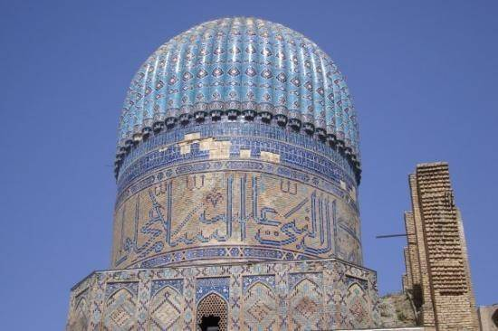

Imagine a country called X, a country with a continuous lineage of 5000 years. And it was filthy rich. In fact it was richer than the rest of 
the world, at that time, put together. And everyone knew that. For the ancient non X, earth dwellers who were not cavemen, X was not a country 
but an entire freakin continent. And their papyrus scrolls showed it that way.

_Rest of Asia, You are not worthy to be on our precious papyrus_

Anyways, as what happens to a rich house in a poor locality, all the have-nots in the world, realizing how much wealth was there for the taking, 
converged onto X. They came in droves, time after time, to help themselves to the unlimited booty on offer. And after a while (seventeen times), 
someone just said ‘screw it, let’s settle down in India once and for all’. And in the process they claimed X theirs, by birth.

It was as if a huge guy walked into a house, sat on its sofa, took out a cigar, and said the house belongs to not only him, but his ancestors as well. 
Without even as much as looking at the original inhabitants. What would or could the poor souls do?

> _This is my house now amigo..._

Whatever they did, it will still be better than what our historians have done.

If you haven’t guessed it by now, Country X is India (I'd prefer calling it "Bharat - Land of Bharata") and the huge guy is an allegory for the 
various Islamic hordes from regions as far as Mongolia to modern day Kazakhstan. So instead of telling our children who this guy really was and 
what he really did, we have deified and honoured this invading band of tribes. In fact most of our medieval history is dedicated to these bunch of 
rear-cracks, for reasons I don’t know. And as our historians lack ’round objects below the abdomen’ to present the true picture of the Islamic rule, 
let me do the job for them.

India’s first encounter with an Islamic ruler started when a douchebag named Mahmud Of Ghazni landed here in 1004 AD. You might have come across 
this guy in your textbook as the dude who raided the Somnath Temple, a little over 17 times. However, what our historians have neglected to mention 
is that this guy did not just raid the Somnath temple, he demolished it every time he came. In fact at one point of time he was so pissed off by our 
resilience, he massacred about 50,000 Somnath inhabitants, razed the temple to the ground again, smashed the ShivLing made from solid gold into tiny 
little pieces and then embedded them in the steps of the Jama Masjid back in his home town of Ghazni, so that the people could step on it while 
[going to pray](https://en.wikipedia.org/wiki/Mahmud_of_Ghazni#Destruction_of_Somnath_Temple).

Had there been a synonyms and antonyms of words in the 1st century AD, the first entry for the words evil, horror, despicable and other similar words, would have been Mahmud Of Ghazni.

> _If evil had a face..This had to be it_

And if obliterating one temple was not enough, he also destroyed the temples in Ujjain and Dwarka and sacked them. In fact, in all his 
invasions he never tried to consolidate his rule in India. All he wanted to do was loot and kill. To sum it up, He came, he saw, he destroyed, 
he looted, unleashed an evil laugh and went back. In Fact he was so evil and caused so much damage to our country, that our friends in Pakistan 
named a freakin missile after him, just to harness his India destruction potential.

> _This was what was left of it after the first launch..._

And that he was evil is not something that is being made up. This was what his own biographer had to say:
> “In the interest of his successors he constructed, in order to weaken the Indian frontier, those roads on which afterwards his son Mahmud marched 
into India during a period of thirty years and more. God be merciful to both father and son! Mahmud utterly ruined the prosperity of the country, 
and performed there wonderful exploits, by which the Hindus became like atoms of dust scattered in all directions, and like a tale of old in the 
mouth of the people. Their scattered remains cherish, of course, the most inveterate aversion towards all Muslims. This is the reason, too, why 
Hindu sciences have retired far away from those parts of the country conquered by us, and have fled to places which our hand cannot yet reach, to 
Kashmir, Benares, and other places. And there the antagonism between them and all foreigners receives more and more nourishment both from political and 
religious sources.”  [Source.](https://books.google.com/books?id=9-yUPk_Q5VsC&pg=PA98&hl=en#v=onepage&q&f=false)

The biographer was executed.

This guy, who will be right up there, in any ‘top 10 evil men of the century’ list, should have been portrayed as the evil version of 
the evil Gabbar Singh, a bandit and a mass murderer. Instead our historians admire his persistence and perseverance. And then, we also name a freakin movie after him.

It is like an MBA book, citing the Nazi holocaust as a case study for logistics management. Perseverance, you must be kidding me.

Sacking and razing the great Indian temples was not the only contribution made by Mahmud of Ghazni to our history. He was the guy, who basically showed the desolate 
regions in central Asia that the unlimited Indian wealth was there for the taking and you just had to turn up. He was the guy who laid the foundation of Islamic rule in 
India for the next 700 odd years.

And we admire his perseverance. *sarcasm*

After Mahmud of Ghazni, all the emperors in the central Asian wilderness were itching to go to India for its limitless wealth. But it took them a 
100 years to actually gather up enough men and material to mount another invasion, simultaneously giving Indians time to replenish their treasure stocks. 
While we were coming back to terms with life, Mahumd Of Ghazni married 9 wives, sired 56 legitimate children and got bitten by a female anophles mosquito and died of 
Malaria (Never underestimate an angry mosquito). After long years of internal squabbling, Mohammad Ghori (Ghauri) finally ascended the throne of Ghazni in A.D 1178. 
And promptly attacked India in A.D 1191.

Opposing him this time was the Rajput king, Prithviraj Chauhan, who famously eloped with [Princess Samyukta](https://en.wikipedia.org/wiki/Samyukta), right under the nose of her father, Raja Jaichand of Kanauj. 
Mohammad Ghauri, thanks to the lessons learnt from Aamir KhanMahmud of Ghazni, was so overconfident about his impending victory that he was already planning the after 
victoy pillage party when he came face to face with ‘My profession, hobby, passion and happiness is war’ Prithviraj Chauhan, at Tarain, some 150 Kms from New Delhi.

He got his ass kicked.

He was not just defeated, he was totally routed. In fact, he got his backside kicked so badly, that he was captured by Prithviraj Chauhan whom he begged for mercy. 
And much to the consternation and objections of his courtiers, (who wanted to chop Ghori’s head off), Chauhan magnanimously spared Ghori’s life and let him return back to Ghazni with his head on his shoulders.

But Ghori, like all other ungrateful wretches, attacked Chauhan again in A.D 1194.

Using some skulduggery and deceit, he somehow manged to defeat Chauhan and his army and captured him alive. He promptly entered Delhi and massacred some 100,000 people combining it with some general pillage and loot thrown in. He then went back to Ghazni, where he executed the man who spared his life three years before. Chauhan was killed with the full knowledge that he had signed his own death warrant.

So according to our Historians

Prithviraj Chauhan, a merciful king, who in a total departure from the general rules of warfare, spares the life of his adversary and under whose aegis, the famous sufi saint Shaikh Salim Chisti was able to establish the famous Ajmer Dargah, is not worthy enough to be mentioned.

While, Mohammad Ghori, an ungrateful wretch, killer of a man who spared his life and 100,000 more, gets more space than [Emperor Harsha and Palas](https://kaipullai.com/2011/09/12/the-greatest-heist-in-indian-history-how-our-history-was-changed-and-we-didnt-even-notice-part-1the-lost-eon-6th-century-b-c-to-1174-a-d/) put together.You think this is travesty, well it only gets worse from here. And yes, Pakistan named another missile after this guy.

Mohammad Ghori, did not have any heir, so he basically carved up his empire among his different Turkish Slaves, with Qutub-ud-Din aibak given the kingdom of India or Hindustan as it was known then. And that started the Delhi Sultanate. Here is a list of the other Delhi Sultanate Rulers

Qutub-Ud-Din Aibak: 1206-1210

Iltutmish: 1210-1236

Razia Sultana: 1236-1240 (Murdered in 1240 because she refused to wear a veil, was secular, tried to appoint a Hindu to an important position and had a relationship with an Abyssinian slave. Resurrected and murdered again by Hema Malini in 1983)

Balban: 1246-1290

End of the Slave Dynasty

---

1290-1320 Alauddin Khilji : Was probably the best of the Sultanate kings. No religious porgorms were reported, and there were no widespread massacres in the name of religion. He was also known to restore a defeated king to kingship in exchange for tribute and gold.

However, his general, a eunuch named Malik Kafur, a Rajput who converted to Islam, marched upto Tanjore in the south for some plunder. He negotiated in such a way that he did not have to fight a single battle till he reached his destination. He/She went south as far as Tanjore, desecrating and sacking temples in Srirangam, Madurai and Chidambaram and taking their solid gold idols away, which was his intention. However, it must be said that unlike the Mahmud of Ghazni, nothing was demolished and all the looting happened without the usual accompanying massacres.

It is said that when Kafur returned to New Delhi, he/she returned with 612 Elephants, Twenty Thousand Horses, 96,000 Thousand Nams (Approximately 241 Tonnes) of Gold and the usual countless boxes of jewels and pearls.

And an eunuch in Delhi was never insulted after that.

This was about the last time, there was a sort-of benevolent Delhi Sultan, as most of the time, the term benovelent Delhi Sultan was an oxymoron. Also please remember Alauddin Khalji, for he has a role later on.

1320-1413 — The Tughlughs: World Famous

1414-1451 — The Sayyidis: Another gang

1451- 1526 —- The Lodis: The Last of the Sultans.

End of the Delhi Sultanate

---

_(The only reason why there is a description for Alauddin Khilji is that, he was the only one who was the chip off the block. The rest were almost similar in nature and evilness. To know more about the others, Please read Mahmud Of Ghazni, do a Ctrl C and a Ctrl V)_

With all these crackpots, (yes Mohammad Tughlugh included) the Delhi sultanate lumbered along for 300 years, with different kings coming, killing and naming different areas in today’s Delhi (Ferozshah Kotla and Tughlaghabad, after Feroz Shah Tughlagh, Lodi Gardens after Ibrahim Lodi and so on) after them and then mostly, getting killed.

I can go on and on about the not-so-nice details that our historians have skipped in this era, for reasons best known to them, but won’t for reasons of brevity. Please visit this [website](http://koenraadelst.bharatvani.org/articles/irin/genocide.html), if you want to know more about this period.  However, I will point some of the really big omissions.

Qutub-Ud-Din Aibak is described by the Indian historians as a slave who worked up to be the king. However, he is famous because of of the eponymous ‘Qutub Minar’ in New Delhi. Our historians lavish some unnecessary praise for what is at best a tall building, shaped like a particular part of the male anatomy.

> _Big deal_

This is what the Archeological Survey of India (ASI) plate at the minar says about this totally pointless tower.

> _‘It is the perfect example of  a minar known to exist anywhere in the world. Thevariegated plan of its three lower stories the projecting balconies with stalactite pendentive brackets and some more mumbo jumbo.’_

However, what our eminent historians have apparently forgotten to mention or deliberately ignored is, that [27 temples were utterly destroyed](https://hindunet.org/hindu_history/modern/kutub_oak.html) and the stones from those very temples were used to build this tower.  And the builders were bloody proud of this fact. So proud, that Aibak and his successors had the gall to inscribe it on the eastern gate of the Qutub complex.

27 temples destroyed for building this ‘thing’ and all our historians do is praise its variegated, pendentic brackets.

Just another thought, isn’t it ironic that most of the areas in our national capital are named after invaders, temple destroyers and who imposed taxes on poor innocents who just happened to be non-Muslims? I doubt any other nation on this planet honours their destroyers in this manner. (America even changed it’s metric system to wash itself off the British influence). Most importantly, nothing is named after the ones who actually did a lot of good for our country.

The Delhi Sultanate, with the exception of Razia Sultana, Balban and Alauddin Khilji,  actually was nothing more than a bunch religious fanatics, who rose to power almost miraculously and then somehow sustained it. However, whatever they did pales in comparison to who followed them, The Mughals.

The name Mughal itself is quite an accident. Genghis Khan, in his many conquests across the length of world, had some fun when he was doing his stuff in Central Asia. The result was a awkward hybrid between Mongol and Persian, which resulted in the name Moghul, which became Mughal. Genghis Khan, gave these guys the right to rule as long as they recognized the superiority of the Khan. All was well, until Genghis Khan died.

Kingdoms those days, especially the central asian ones, were not entirely unlike a bunch of kids in the first standard. Totally quiet till you have a teacher in a class, only to explode the moment teacher leaves. The only difference was, these guys had swords, spears and cannons to settle their disputes.

So amid all the bloodshed and anarchy, there rose a warrior who united them all. And he was lame and he looked like the illegitimate child of the ugliest ogre.

> _This was apparently his best pic_

So lame guy, kills everyone else, captures the capital city of Samarkand and declares himself king. And then attacks, you guessed it right, India.

Attacking and plundering India was like a high point in a Mongol’s life, something you had to do to prove to rest of the world that you were a man. Mongols, before Timur,  repeatedly attacked India, and once almost defeated the then emperor Alauddin Khilji. Which was when Khilji decided that shit had really hit the fan. So the next time Mongols came, he sent the now legendary Malik Kafur after them, who annihilated them in open battle. And just to drive home the message, Khilji had all the prisoners (some 10,000 dudes) trampled by elephants, their heads cut off and displayed as scarecrows outside his fort in Siri.

The Mongols did not come back.

Till Timur the Lame.

When Timur the lame, attacked India in A.D 1398, the Delhi Sultanate was in a total state of anarchy. So he basically had a free pass. Brushing aside whatever little resistance he faced, he got busy doing what was considered his dynasty’s expertise.

> _There are a 100,000 people in this stadium_

Just imagine, every single human in this crowd, speared through the chest, decapacitated and their heads stacked up in a Jenga like formation outside a city. Which was exactly what Timur the lame did.

To discourage resistance or mebbe he just got a kick out of it, Timur killed 100,000 ‘non Musulmáns’, cut their heads off and built a [skull-wall outside Delhi](https://en.wikipedia.org/wiki/Timur#Indian_campaign). When the terrified Dilliwallahs capitulated, he walked in and killed the rest to the last man, woman and child, excepting the quarter which had ‘saiyids, the ‘ulamá, and other Musulmán’ and went back with another trove of cash, gold and jewels. He also apparently sent out an order that, every soldier in his looting column had to return with at least two severed human heads to show him.

And, how did Timur justify these dastardly acts of violence: ‘Muslim Delhi Sultanate was too tolerant toward its Hindu subjects’. Yes, too tolerant.

> _Built entirely using Indian money_

And the first emperor of the much celebrated by our historians, Mughal Dynasty, Emperor Ẓahīr ad-Dīn Muḥammad Babar was the great great grandson of this murdering wretch. Yes, a direct descendant.

So now you know why the ancestry of the great Mughal empire has been conveniently hidden from us for so long. You don’t want to tell the people that the empire we celebrate the most, and dedicate the maximum space in out history books to, is directly responsible for the most destructive religious and ethnic cleansing ever in Indian history. And as portrayed in our textbooks, Babar did not land in India because he was a great visionary or an emperor. He came here simply because he had nowhere else to go.

He tried to capture Samarkand, in modern day Uzbekistan where he got his ass kicked by the Uzbek king Shaibani Khan. Reduced to a wandering nomad but with the support from the then Persian king, he landed at the gates of India, where to his luck the Lodi’s were in strife. And before you know it, he was the ruler of India. And he had the temerity to claim the throne of India, ‘as his right’.

> _And he was scary_

Babur set about expanding his kingdom, defeating the Rajputs, capturing the fort of Chittor and also is credited with the world’s first execution by firing squad, when he ordered his musketmen to kill the 100000 prisoners of war. His rule was in no way better than the others, as Indian historians potray. He defaced Jain temples in Rajashtan, simply because he could not stand them. And ofcourse he demolished the most famous temple of all, the [temple at Ayodhya](http://web.archive.org/web/20050323101829/http://www.the-week.com/23sep07/events1.htm) to build the  eponymous mosque, the Babri Masjid. So Babar is directly responsible for the communal tension in our country today. And our historians, lead by the esteemed Ms Romila Thapar continue to deny this, in face of clear evidence, and as a result we are kept completely in the dark.

On a related note, it is deeply distressing that the most comprehensive work detailing the wanton destruction of temples and massacres perpetrated by the sultanate and their successors comes from a Belgian Historian, [Koenraad Elst](http://koenraadelst.bharatvani.org/index.html). Yes a Belgian.

I feel these not-so-good things should be expunged from our History for obvious reasons. But when I read successive chapters in Indian history textbooks dedicated to the glorification of these very emperors, I felt I had to bring out the real story. I apologize if I hurt some sentiments, It is not my intention. But I ask
1. Why glorify the Mughal rule, when it was their ancestor who was the architect of one of the most destructive religious pogroms?
2. If you are mentioning Ghazni’s 17 incursions and describe him as persistent, why not tell what he actually did those 17 times?
3. When you credit the Delhi Sultanate for bringing stability to India, why hide their less glorious stuff like forced conversions, wanton looting and‘jiziya’?
4. Most importantly, Why do you think our countrymen cannot handle the truth?

_Photo by Abhishek rana on Unsplash_
