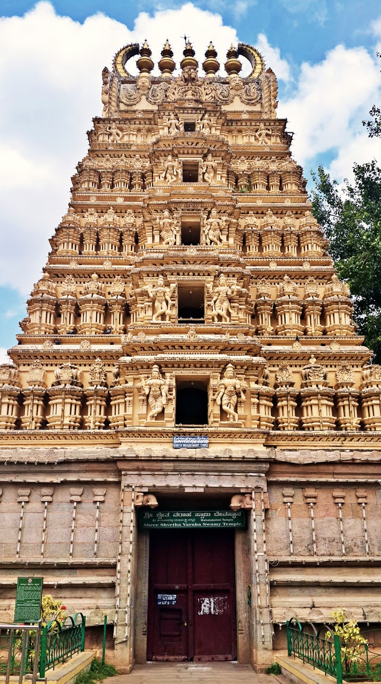

## How the British distorted Indian History

The history writing by the British was a deliberate and systematic effort. The British used history of India as a tool for demoralizing the natives. History of India was twisted, falsified and misinterpreted on a grand scale. In a letter dated December 16, 1868 the famous Indologist Max Muller wrote to the Duke of Argyll, the then Secretary of State of India, 'India has been conquered once, but India must be conquered again and that second conquest should be a conquest by education'.. (Ref: 'The Life and Letter of F. Max Muller, edited by Mrs. Max Muller, 1902, Vol.1, p.357). Prof. Max Muller was not just a philosopher, he was also an examiner for the Indian Civil Service (ICS) examination. Teaching of falsified history played a great part in this 'second conquest'.

### 1. Who were these British history writers ?

* They were mainly army officers and administrators of the East India Company. For example:
* Major General John Malcolm - A Memoir of the Central India (1824)
* Captain Grant Duff - History of the Marathas (1826)
* Gen. Briggs - History of the Rise of Mohammedan Power in India (1829)
* Lt.Colonel James Todd - Anals and Antiquities of Rajasthan (1829-32)
* M. Elphinstone (Resident at Peshwa Court, later Governor of Bombay), History of India (1841)
* Joseph Cunningham (brother of Gen.A.Cunningham) History of Sikhs (1849)
* Lt. R.F.Burton - History of Sindh (1851)

Thus this is akin to victors writing the history of the vanquished. How many American Western movies depict the generosity and the bravery of the native Americans ? Do you know of a single British movie depicting the courage, intelligence and skill of the German and Japanese soldiers? Hence we can imagine what kind of 'history' these British officers and administrators must have written or the slant there in.
But these very books became standard textbooks in India and were prescribed for teaching the later day examinees of the Indian Civil service and the Indian army.

### 2. Effect of British Version of History on Indian Leaders

Since almost all our leaders were educated under the British system this slanted history had tremendous impact on the psyche of our leaders. By learning such history our leaders developed a severe inferiority complex, and suffered from loss of self confidence and self esteem. They started despising their ancestors. They became convinced that unless they followed the West blindly, borrowed ideas, concepts and technology from her India had no salvation.

Let us see what our leaders were saying over the years :
> "These (British) Gurus have been sent by God from far off lands" 
G.H.Deshmukh alias Lokhitawadi in 1848 CE in Shatapatre no.46. This view was also shared by Justice M.G.Ranade and Mahatma Phule.

> "It must indeed be considered our good fortune that when Christian missionaries set out to spread Christianity in the world, they did not forget India..." 
Keshavachandra, Brahmo Samaj leader in 1860 CE.

Mahatma Phule started Satya Shodhak Samaj (Society for Search of Truth) in 1873 CE. Everyone joining the society had to take an oath of allegiance to the British Crown. 
> "How can Hindus, who were ruled by Muslims for 700 years and are being ruled by the British for last 75 years claim to have a glorious past?" 
- G.G.Agarkar in 'Sudharak' (Reformer) in 1885 CE.

Of course Agarkar would not say the same about the Spaniards or the Portuguese who were ruled by the Arabs for 600-700 years. Agarkar's native Maharashtra was ruled by Muslims for 380 years (1296 to 1674 CE) and not 700 years, but that did not matter).

Gopal Krishna Gokhale founded Servants of Indian Society in 1905. The members of this order were committed to a frank acceptance of the British connection as ordained in the inscrutable dispensation of Providence for India's good (Ref: Political India 1832-1932',J.Cunning ,editor, 1932, p.186).

This despite the horrors of British administration during the plague outbreak of 1897 and 7 years of suppressive reign of Curzon (1898-1905).

'The Hindus' has been a life of continuous defeat. It is a mode for survival of which every Hindu will feel ashamed'- Dr.Ambedkar in 1937.

Even the anti-Hindu writer of 'Early History of India' like Vincent Smith dismisses such fantastic statements. Savarkar wrote a resounding reply to Ambedkar's outburst and said 'What Ambedkar says is false. Hindus have survived the onslaughts of the foreigners over the centuries because of their bravery. But even if what Ambedkar says were true, should he not be determined to avenge past defeats ?'

Amazing ! What kind of history of India was taught to our leaders ?

### 3. British Version of Indian History

The history of India, written by British authors was, in a nutshell, as follows:
Until the invasion of India by Alexander the Great, there was nothing worth mentioning in India. After Alexander, the Greeks taught civilization to Indians, and gave them the Western ideas. Then came the Shakas, Huns, Kushans etc. They also kept teaching the natives. In the eighth century Mohammed bin Kasim invaded India. It marked the begining of the Muslim rule. Then came the Ghazanvis, Ghoris, Gulams, Turks, Afgans, Khiljis, Tughalaqs, Lodis and Mughals. They were very brave and noble. They carried out reforms after reforms. Lastly came the English. They could not tolerate the prevailing anarchy. 'We rule India' they said. Some kings accepted their protection. Those who resisted, collapsed like a deck of cards. The British taught peace and prosperity to this troubled land. Under them everyone is happy. They introduced rule of law which Indians never knew before.
Thus the history of hindus (according to the British) is as dark as coal tar. There is nothing in it to be proud of. It is natural that only foreigners should rule India. The best the natives can do is to serve the British by becoming their obedient servants.

Why could Indians not counter them with our own version of history ?

### 4. Neglect of History in India

It must be admitted in all fairness, that it was the British who first wrote the history of India. The Hindus probably are the only race, who despite having such intelligence, bravery and tremendous capacity for successive revivals, have showed such pathetic neglect of history.

There was utter lack of historical sense. Lokamanya Tilak writes '.. Even if we read the whole of Harsha-Charita by Banabhatta, we cannot make out when did this famous king rule or what was the extent of his kingdom ? Had it not been for the Chinese traveller Hsuen Tsang (and the English scholars who translated his memoirs from Chinese into English) we would have never known the history of Harsha.

Records were not properly kept and where they were kept they were not preserved. Even today very important documents are getting rotten and destroyed by insects, in many families, but the owners will not give them to historical societies.

History as a subject did not always have a place in education. For example, Maharaja of Jaipur, JaiSingh I never learned about the history of Bappa raval, Prithvi raj Chuhan, Mahmud of Ghazni, Mohammed Ghori and others. During the upbringing of Peshwa Bajirao I, he learnt nothing about the East India Comapny and its resistance to Shivaji at Surat, the history of the Mughals or the history of Maratha-Mughal struggle. Far reaching consequences of such neglect were never realized.

A true historian should have the ability to doubt the validity of currently held beliefs in light of new evidence. reject the traditional line of thinking when it becomes evident that it was based on wrong assumptions or weak, flimsy foundations. Analyze the evidence critically and establish the facts based on common sense, reason and logic.

All this was cleverly disallowed by the British. Historical research was reduced the drab work of compiling data and translation of documents. The faculty of interpretation was strongly discouraged.
It is therefore essential that Indian history be rewritten.

### 5. Rewriting Does Not Mean Fabrication

It must be emphasized that rewriting of Indian history does not mean fabrication, as was done by the Nazis or the Communists.

Savarkar wrote in 1937 : 
> 'To praise one's ancestors out of affection for them may be foolish, but humane. However to tolerate deliberate denunciation of the ancestors without challenging the allegations is disgraceful. Because such falsehoods, if repeated often will make us lose self respect and confidence'.

> 'Only those people avoid mention of their defeats in the past that are not strong enough to avenge the defeats'.

> 'When writing history the writer must write the events as they happened. He should not concern himself about the effect of that writing on present situation. .. It is natural to write about glorious deeds of our forefathers, but we are reluctant to describe disgraceful event or disasters, defeats. A historian must avoid such hiding of facts. Whatever happened in the past it should be described as it happened...'

### 6. Late Awakening

There were some scholars during the British Raj who realised the importance of history in nation-building. They were furious at the state of affairs. Rajwade, Vasudevshastri Khare and others started work around 1900 CE. The formidable task of collecting and compiling evidence was so immense that Rajwade could not foresee the starting of writing of the History of the Marathas, in his life time.

In 1907 Savarkar came to London. After studying the contemporary British books in India Office Library he concluded that he had to reject the traditional view of the Great Revolt of 1857. It was not a Sepoy Mutiny as commonly believed. The British authors themselves do not use the term Sepoy Mutiny, instead they call it Indian Mutiny. Savarkar Proclaimed that it was a War of Independence in which everyone from the Maharajas to the road sweepers took part. His book was promptly proscribed even before its publication ! Savarkar protested on September 17, 1909 'If my book is seditious, why does not the Government show courage to take me to court ?' The British Authorities did not prosecute Savarkar for his book. Such is the importance of true history.

In 1991 Bharat Itihas Sanshodhak Mandal (Indian Society for Historical Research) was formed.
In 1918 Mr.N.C.Kelkar, one of Lokamanya Tilak's lieutenants, published a book "Marathas and the English' which dismissed the traditional theory that Marathas lost due to internal dissensions, lack of unity and lack of foresight.

In 1923 Major B.D.Basu wrote 'The Story of Satara' exposing the barbaric behavior of the British to Maharaja Pratapsingh of Satara who was falsely accused and dethroned in 1839.

G.S.Sardesai's 'New History of Marathas' came out in 1946 exactly 120 years after Grant Duff's History of the Marathas. Incalculable damage had been done in 120 years.

But the awakening had begun. The question then arises, why did not things change after the British left India in 1947 ?

### 7. Appeasement of Muslims By Congress Leaders

The reason why Indian history was not rewritten much after 1947, is to found in our freedom struggle. Gandhi returned to Indian in 1915 and after Lokmanya Tilak's death became the leader of the freedom struggle. Gandhi himself had shamelessly supported the British during the British -Boer war, British-Zulu war (also known as Kaffir Wars) and the World War I. In fact, Gandhi volunteered to organize a brigade of Indians to put down the Zulu uprising. Sergeant-Major Gandhi, the deputy commander of his cops - himself carried the stretcher of the mortally wounded British commanding officer from the Zulu war battle field for miles over the sun-baked veldt. Thence he was awarded Victoria's coveted War Medal for valor under fire. However by the time of his return to India Gandhi was so obsessed with Ahimsa (non-violence) that he condemned Rana Pratap, Shivaji and Guru Govind Singh for their armed struggle. Savarkar proclaimed 'We Hindus on our own can win our freedom from the British'. Gandhi lacked Savarkar's confidence and conviction. This led to his perpetual capitulation to Muslim demands and finally culminated in the horrors of partition.

After the horrible Mopla riots in 1921 when over 5000 Hindus were killed by the Moplas of Malbar. But Gandhi had no hesitation calling them 'My brave Mopla brothers!' In December 1926 when a fanatic Muslim Abdul Rashid killed Swami Shraddhananda who had converted thousands of Muslims to Hinduism, Gandhi immediately pleaded that Brother Abdul Rashid's life be spared. But he refused to plead for life of Bhagat Singh and others only six months later.

In 1938 Hindus launched an unarmed struggle for their legitimate rights in Hyderabad state, Gandhi did not support them and said 'I do not want to embarrass the Nizam'.

Congress was in power in C.P., U.P., Bihar, Orissa, Bombay and Madras from 1937 and 1939. Not once the Congress ministers stood up to unreasonable demands of the Muslims. The same lieutenants became chief ministers of various states in 1946.

After independence Nehru's secularism always meant capitulation to Muslims and anti-Hindu politics. Thus under Nehru years and early Indira Gandhi rule Gandhian appeasement hangover was still intact. It must be noted that during all the Lok Sabha elections after 1947, the Congress party todate has NOT EVEN ONCE received even 50 percent of popular vote. Thus a 10 percent vote swing can change the power equation in New Delhi. Under these conditions, Muslim vote bank had disproportionate importance. Thus in later years (particularly after emergency) capitulation to the Muslim demands and appeasement became a tool for staying in power. In the zeal for retaining the power, true history has become the first victim.

### 8. Effect of Appeasement of Muslims

Encyclopedia of Britannica says "Hindu Architecture .. It should be noted that there exists in India a vast technical literature known as Shilpa Shastra.. dating back to Gupta period perhaps much earlier, the medieval compilations are still in use by Indian Architecture." The first victim of appeasement is Hindu architecture which is not taught at all in the Architecture and engineering schools. What ever insignificant part is taught is taught with Greek or Roman titles under 'Indo-Sarcenic architecture'.

Veer Savarkar delivered lectures in 1950-51 exposing how the Indian history is written with a strong anti-Hindu slant. These later appeared in newspapers. However no publisher dare publish his book 'Six Glorious Epochs of Indian History' (This book destroys the myth that Hindus suffered defeat upon defeat, and asserts that Hindus survived aggressions because they fought tooth and nail to preserve their religion and culture. A MUST READ BOOK FOR ALL HINDUS - you have read British and Muslim Version of your history, why not read your own side of it.) foreign invaders.

A school in Bombay used to teach Gita as the part of studies. It was not objected to by the British. But in 1963 Education Department of Maharashtra threatened to stop the Government grant until Gita teaching is stopped. Of course the government provides grants to Madrsas and convents without hesitation.

Nehru even wanted to remove word 'Hindu' out of Benaras Hindu University, but not the word 'Muslim' from Aligarh Muslim University.

When Abdul Reheman Antulay was chief minister of Maharashtra, a deputation of Muslims demanded following:
* Urdu should be a compulsory subject in schools
* 25 % of seats in Police and Civil Service be reserved for Muslims
* Government land be given to build mosques

After this, an Urdu Academy was started in Maharashtra. Government newspaper Lokrajya is now published in Urdu and Marathi. There are no prizes for guessing how many people in Maharashtra speak Urdu (If you consider Muslims from Miraj as Urdu speakers, you must be calling Bombay Hindi as the best Hindi ever spoken).

Urdu was made second state language in Bihar in December 1980 even though the regional language Maithily spoken by 5 times more people was denied the status. In U.P. Urdu was made a second language in February 1982.

In December 1981, Indira Gandhi recognized the Moplas as patriots, freedom fighters despite their barbaric atrocities on Hindus in 1921.

July 18, 1982 issue of 'Shree' a Marathi weekly from Mumbai carried an article by Mr.D.B.Pradhan entitled 'Pre-Islamic Vedic Religion in the Gulf States'. Government of Maharashtra immediately banned the issue under the pretext that it hurt sentiments of Muslims. Mumbai High Court later declared the ban illegal.

The most flagrant and unashamed example of Muslim appeasement came under V.P.Singh who declared Prophet Mohammed's birthday an Indian national holiday. In his obsession for Muslim appeasement he did not realize that the birth and death of Prophet Mohammed fall on the same day. That day, Id-e-Milad was already a national holiday!

Last year Doordarshan started a Urdu news broadcast in Banglore even though there are more people in Karnatak speaking Marathi, Telugu, Tamil than Urdu. These led to riots when Muslim pelted stones from a mosque on a peaceful procession.

During the past 5 years how many times have you heard from the GOI about the 300,000 Hindus from kashmir valley who are refugees out by in their own country. How many times has GOI spoken about rights of minorities in Kashmir valley ? None of the recent 3 prime ministers ever bothered to visit refugee camps even in New Delhi. Mean while GOI provided free plane rides to evacuate mostly Muslim Indians from Kuwait and Iraq in 1992.

### 9. Appeasement of Muslims Leads to Falsification of History by GOI

In December 1937, Savarkar said 
> "Following appeasement of Muslims, the government is now trying to pervert history. It is well known that in 1318, Harpaldev of Devagiri was skinned alive by Kutb-uddin Khilji of Delhi. This fact is hidden and the history books tell us that he was simply arrested. Sambhaji, the brave Maratha king was also tortured to death by Aurungzeb. But history books say that he too was simply arrested. How shameless can they be!"

In the same year Savarkar wrote 
> "Look at the present attempt by Gandhi and his followers to suppress the atrocities of Muslim rulers and even glorify them (for e.g. Siraj-uddaula and Tipu) .. But has this perversion stopped the riots and the arrogance of Muslims ? No.. It is nonsense to say that if we describe the battles or conflicts of the past, the present generation will fight battles again!"

The practice of perverting history continues. Here are some examples:

In the medieval times the main source of government income was the land revenue. Under Hindu rulers its used to be 16 %. Under Akbar it became 33 %. It stayed same under Jehangir. Under the 'Golden' rule of Shah Jahan it was raised to 50 % and it stayed the same during Aurungzeb who added Jizya tax on Hindus. Under Allauddin Khilji the land revenue also was 50 %. This information is kept out of history books.

We are taught that in 1303 CE Allauddin Khilji defeated Rajputs and captured Chitod Fort. But we are never told that Hamer Singh, a Rajput prince defeated and recaptured the fort 10 years later.

It is well known that Prophet Mohammed fled from Mecca to Medina in 622 CE. Muslims all over the world accept the fact. But in 1982 under pressure from Muslims Maharashtra government ordered that word 'fled' must be deleted. So now it reads that Prophet Mohammed went from mecca to Medina in 622 CE. Even Nehru would have been amazed by this because in his book 'Some Glimpses of World History' he does say that Prophet Mohammed fled from mecca to Medina.

In 1982 the Central Ministry of Education issued guidelines for writing and teaching of Indian history which among other things forbid describing the medieval period as a period of conflict between Hindus and Muslims. In short, Shivaji's virtues should not be glorified and Aurungzeb's bigotry and despotic nature must not be described !

In 1982 Archaeological Survey of India (ASI) in their publication 'Taj Museum' admitted that on the site of Taj Mahal stood the mansion (manzil) of Raja Man Singh which was at the time of in possession of his grand son Raja Jai Singh. So what happened to the mansion ? The answer is simple. It is the same as Taj mahal. But that much ASI official would not concede.

In 1984 Prof.Marvin Mills wrote Director General of Archaeological Survey of India that the Taj dispute be settled by scientific tests on brick samples taken on 20 locations. The Director General replied "The Taj is well dated on documentary evidence. BARC, Bombay and PRL, Ahmedabad are also seized of the problem. (this was a lie. Both the labs did not receive any samples for testing) and IT IS NOT CONSIDERED DESIRABLE TO HAVE ANY FURTHER INVESTIGATION AT THIS STAGE.

Such has been Government of India. What about the historians?

### 10. Attitude of Indian historians

In 1984 , the discovery of so called Hitler's diaries by Stern Magazine created an international sensation. Initially the British historian Prof. H.T.Roper said the diaries were authentic. Later when the diaries were found to be forgeries, Prof.Roper candidly admitted "If I am wrong, I am wrong. .. even experts can err". Indian historians lack such intellectual honesty. Let us look at following examples.

Historicity of many theories has not been challenged by Indian historians. In December 1963, the 'Hazarat Baal'(supposedly Prophet Mohammed's hair) disappeared from the shrine in Srinagar. It was 'found' a few days later. Firstly, no Indian historian has bothered to ask that if even Mecca and Medina do NOT contain any relics of the Prophet, where did this hair come from 700 YEARS AFTER THE PROPHET'S DEATH ? Also no Indian historian has asked that since the Hazrat Baal, the hair disappeared in 1963 and reappeared a few days later, is it the same hair ? Suddenly all the historians consider it an authentic historical relic.

Second of course is the case of Taj mahal. Shah Jahan's 'Badshahnama' which is the only major Mughal document the British did NOT translate (perhaps intentionally) categorically states that it was Raja ManSingh's palace that was taken over by Shah Jahan. In 1968 when P.N. Oak published his theory based on his translation of Badshahnama, suddenly those very pages were declared irrelevant and out of context by Indian historians. If Mr. Oak's translation is wrong then why do the Indian historians have courage to publish word to word translation of the Badshahnama as Mr. Oak has done or accept his translation.

Two letters exposing falsity of Taj Mahal legend by Mr Oak, et al. were published in the internationally renowned 'Royal Institute of British Architects (RIBA) Journal in June and September 1980. No architect or historian has challenged these letters. Indian historians have of course kept quiet.

The most glaring intentional scientific fraud by historians under government payroll, came after December 6, 1992. During the destruction of Babri structure various remnants of the pre-existing temple surfaced. These included a shila-lekh describing the origin and scale of a magnificent temple at the very site of Ram Janma Bhumi, several intricate carvings and an image of Shri Ram. Instead of verifying or falsifying the historicity of the evidence in the field, 70 of these 'eminent' historians and archaeologists (from JNU) took at out full page advertisements in national newspapers the very next day proclaiming 'the evidence was planted'. Of course they did not want to perform scientific tests on the evidence. What if the truth is revealed ?

Of course no Indian historian questioned why only the key pages from Babarnama, for the 3 months of 1528 CE during his stay in Ayodhya are missing?

### 11. Reasons for the attitude of Indian historians

The reason for the deliberate distortion of history by Indian historians is that they are afraid to lose their jobs or the government patronage. What kind of a job would a history professor get if he is branded a Hindu reactionary and sacked ? Also what will happen to their historical societies if the government patronage were stopped. ALL THIS IS UNDERSTANDABLE. but then they should at least admit that their work has limitations, their freedom is restricted and that they do have to bow to political pressure. But THEY PRETEND OTHERWISE and mislead the people.

Let us look at another example of how the government pressurizes historians to conform to its 'party line'.
B.M. Purandare's predicament:

Mr. B.M.Purandare has to his credit "Raja Shiv Chhatrapati".But he also maintains silence on subjects like Padmini and Taj Mahal. Here is how the Congress government makes him silent.

Mr. Purandare raises money for many charitable causes, from his lectures on Shivaji. An institution (a school, orphanage, a trust etc) would arrange his lectures. The money raised by ticket sales would be given to Mr.Purandare, which he would promptly donate to the relevant charity. A noble act indeed ! But the 'secular' government officials did not see it that way. Income tax officials said that the money thus raised was given to Mr.Purandare. So it is his income and as such he must pay tax on it ! While the Maharashtra Government officers maintained that by delivering lectures on Shivaji, Mr.Purandare was entertaining people. As such he must pay entertainment tax ! After a great deal of public outcry Mr. Purandare's lectures were given exemption from the entertainment tax. But Mr.Purandare knows well that the secular government can remove that exemption any time and therefore he cannot expose its Muslim appeasement.

Isn't it amazing that Maharashtra Government considers movies on Gandhi and Ambedkar exempt from entertainment tax, but lectures on Shivaji for a charitable organization are not exempt ?

(Other examples of historians maintaining silence despite evidence to the contrary are Mr.D.V.Potdar, Dr.G.H.Khare, Mr.Setu Madhavrao Pagdi and Prof. Ram Nath.)

### 12. Conclusion

So... neither the Government of India nor the Indian historians are going to write the true history of India. Not only that, Government of India is perverting Indian history in the name of national integration ! If you feel uneasy and annoyed at the state of affairs and are concerned about the fate of the nation it is for you to help us. Remember the teaching of falsified history affects us all, whether we stay in India or abroad. It molds our mentality. It determines how we behave with one another and with non-Indians and what is more important, how non-Indians treat us.

_Photo by Chandan Chaurasia on Unsplash_